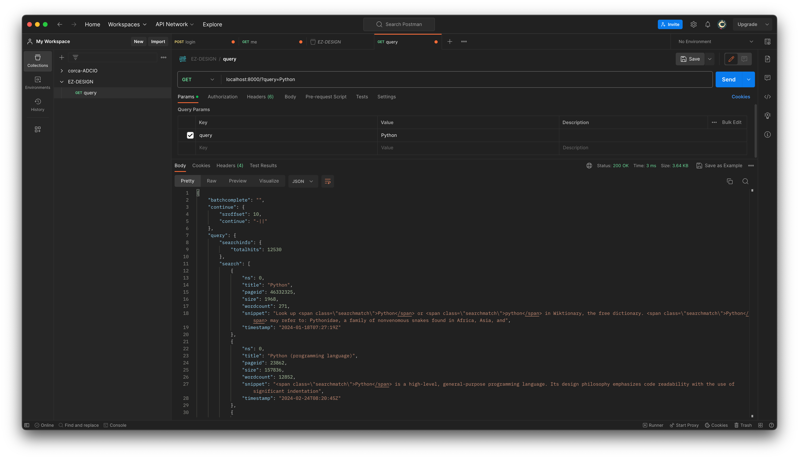
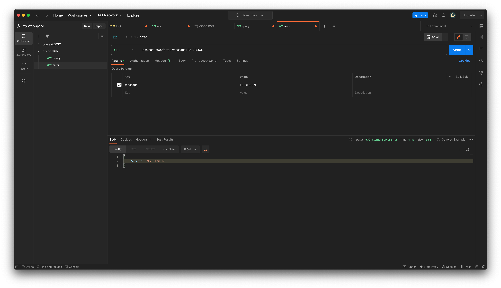

# Week 2

decorator, chain of responsibility, singleton, proxy 패턴에 대해 공부합니다.

</br>

## Lecture

- [decorator](https://refactoring.guru/design-patterns/decorator)
- [chain of responsibility](https://refactoring.guru/design-patterns/chain-of-responsibility)
  - decorator와 매우 유사한 패턴으로, 특히 [express의 middleware](https://expressjs.com/en/guide/using-middleware.html)와 같이 웹서버에서 자주 나오는 패턴입니다.
- [singleton](https://refactoring.guru/design-patterns/singleton)
- [proxy](https://refactoring.guru/design-patterns/proxy)

### Decorator

- `decorator` 는 객체에 새로운 행동을 동적으로 추가할 수 있게 해주는 구조적 디자인 패턴
  - 해당 패턴은 객체를 특별한 래퍼 객체 안에 배치함으로써 이루어짐
  - 이 래퍼 객체들을 객체에 추가되는 행동들을 포함하며, 이를 통해 상속을 사용하지 않고도 행동을 확장하여, 런타임에 객체의 행동을 변경하거나 여러 행동을 조합할 수 있음

### Chain of Responsibility

- `chain of responsibility` 는 요청을 처리할 수 있는 객체의 체인을 통해 요청을 전달하는 방식의 행동 디자인 패턴
  - 각 핸들러는 요청을 받아 처리할 수 있으면 처리하고, 처리할 수 없거나 추가적인게 필요한 경우 다음 핸들러로 요청을 전달함

### Singleton

- `singleton` 은 객체의 인스턴스가 단 하나만 생성되도록 보장하고, 이 인스턴스에 대한 전역 접근을 가능하게 하는 생성 디자인 패턴
  - 해당 패턴은 클래스의 단일 인스턴스만을 보장하고, 이 인스턴스에 대한 전역 접근을 제공함
  - 이는 SRP(Single Responsibility Principle)를 위반하지만, 데이터베이스 커넥션이나 파일시스템 같이 특정 상황에서는 매우 유용할 수 있음
  - 멀티 스레드 환경에서 여러 스레드가 싱글턴 객체를 생성하지 않도록 주의해야 함

### Proxy

- `proxy` 는 다른 객체에 대한 중간 대리자 역할을 하며, 원래 객체에 대한 접근을 제어하여 요청이 원래 객체에 전달되기 전이나 후에 무언가를 수행할 수 있도록 하는 구조적 디자인 패턴
  - 직접 접근 제어를 통한 보안, 요청의 로깅 및 캐싱 등 매우 다양하게 활용되는 패턴

</br>

## Assignment

[fast api](https://fastapi.tiangolo.com/tutorial/first-steps/)로 간단한 wiki 프록시 서버를 만듭니다.

- request를 처리하는 함수의 시그니처는 함수명을 제외하고 아래와 같아야 합니다.
  ```python
  @app.get("/")
  @some_decorator1
  @some_decorator2
  def process_request(request: Request) -> Any
  ```
- 아래 3개 decorator를 구현해서 아래 2개 경로의 요청을 받는 함수에 대해서 모두 적용합니다.
  - @log_request_handler
    - 각 요청별로 아래와 같은 사항들을 로깅합니다.
      - request processing time
      - reqeust method
      - request url
      - client ip
      - response status code
  - @cache_response
    - search api가 매우 느리기 때문에 query별로 요청에 대한 응답을 캐싱할 수 있어야 합니다. 그렇기 때문에 임의의 api path에 대해 일반적으로 적용할 수 있는 데코레이터를 구현합니다.
    - (url, method, client ip, query param) 으로 response를 캐싱합니다.
    - cache 저장소는 singleton 객체입니다.
    - singleton 대신 global variable을 사용하면 안 됩니다.
      - 각 요청을 처리할 때마다 singleton 객체를 `Singleton()` 와 같은 형태로 호출할 수 있어야 합니다.
  - @exception_handler
    - 요청을 처리하다 에러가 나면 아래와 같은 요청을 반환합니다.
      - status code: 500
      - response body: `{”error”: {message}}`

1. `GET /?query={query}`
   - url로 query가 들어오면 [wiki search api](https://www.mediawiki.org/wiki/API:Search)를 사용하여 대신 결과를 전달합니다.
   - wiki search api를 요청하는 객체는 singleton 패턴으로 구현돼있어 임의의 요청이 들어와도 그 객체를 통해 wiki search api를 콜해야 합니다.
     - 이 api는 매우 느려서 search api 요청을 날리기 전에 5초 기다렸다가 실행해야 합니다.
2. `GET /error/?message={message}`
   - url로 message가 들어오면 message를 담은 Exception을 raise합니다.

</br>

## Apply

```python
# decorators.py

def log_request_handler(func: Callable) -> Callable:
    async def wrapper(request: Request, query: str = None) -> JSONResponse:
        ...
        return response
    return wrapper

def cache_response(func: Callable) -> Callable:
    async def wrapper(request: Request, query: str = None) -> JSONResponse:
        ...
        return response
    return wrapper

def exception_handler(func: Callable) -> Callable:
    async def wrapper(request: Request, query: str = None) -> JSONResponse:
        ...
        return response
    return wrapper

```

- `log_request_handler`, `cache_response`, `exception_handler` 을 통해 `decorator` 패턴을 구현
  - 이 패턴은 기능을 동적으로 추가할 수 있게 하며, 서브클래스를 만들어 상속을 받는 것보다 유연하게 객체의 행동을 확장 할 수 있음

</br>

```python
@app.get("/")
@log_request_handler
@cache_response
@exception_handler
async def process_request(request: Request, query: str = None) -> JSONResponse:
    . . .
```

- `@log_request_handler` → `@cache_response` → `@exception_handler` 를 통해 `chain of responsibility` 패턴 구현
  - 요청 처리 객체를 체인처럼 연결하여 위의 순서대로 처리되며, 요청이 체인을 따라 전달하여 처리하도록 여러 핸들러가 각자의 역할을 수행함.

</br>

```python
class SingletonMeta(type):
    _instances = {}
    def __call__(cls, *args, **kwargs):
        if cls not in cls._instances:
            cls._instances[cls] = super().__call__(*args, **kwargs)
        return cls._instances[cls]

class CacheStorage(metaclass=SingletonMeta):
    . . .

class WikiSearchAPI(metaclass=SingletonMeta):
    . . .
```

- `SingletonMeta`를 구현하고 `CacheStorage` 와 `WikiSearchAPI` 에서 메타클래스로 이를 활용함으로써 `singleton` 패턴 구현
  - 이를 통해 이들 클래스의 인스턴스가 프로그램이 실행되는 동안 단 하나만 생성되도록 보장

</br>

```python
class WikiSearchAPI(metaclass=SingletonMeta):
    BASE_URL = "https://en.wikipedia.org/w/api.php"

    def __init__(self):
        self.client = httpx.AsyncClient()

    async def __aenter__(self):
        return self

    async def __aexit__(self, exc_type, exc, tb):
        await self.client.aclose()

    async def search(self, query: str):
        await asyncio.sleep(5)

        params = {
            "action": "query",
            "format": "json",
            "list": "search",
            "srsearch": query,
        }

        response = await self.client.get(self.BASE_URL, params=params)

        return response.json()
```

- `WikiSearchAPI` 클래스를 구현체로써 `proxy` 패턴을 구현
  - 실제 wiki search api에 대한 요청을 해당 객체가 대신 전송하며, 프록시 패턴에 따라 요청 전이나 후에 필요한 추가 작업(ex. 5초 대기)을 수행 하도록 작성

</br>

## Tests

### 1. `[GET] /?query={query}`



```shell
╭─     ~/Desktop/bellti9er/EZ-DESIGN-study/week2     week2 !1 ?1 ───────────────────────────────── ✔  6s    EZ-DESIGN-study    19:23:39   ─╮
╰─ uvicorn main:app --reload                                                                                                                         ─╯
INFO:     Will watch for changes in these directories: ['/Users/jongbeom/Desktop/bellti9er/EZ-DESIGN-study/week2']
INFO:     Uvicorn running on http://127.0.0.1:8000 (Press CTRL+C to quit)
INFO:     Started reloader process [29245] using StatReload
INFO:     Started server process [29247]
INFO:     Waiting for application startup.
INFO:     Application startup complete.
2024-02-25 19:23:47,428 - INFO - Creating a new instance of CacheStorage
2024-02-25 19:23:47,428 - INFO - Creating a new instance of WikiSearchAPI
2024-02-25 19:23:53,203 - INFO - HTTP Request: GET https://en.wikipedia.org/w/api.php?action=query&format=json&list=search&srsearch=Python "HTTP/1.1 200 OK"
2024-02-25 19:23:53,206 - INFO - {"request_process_time": 5.778420925140381, "request_method": "GET", "request_url": "http://localhost:8000/?query=Python", "client_ip": "127.0.0.1", "response_status_code": 200}
INFO:     127.0.0.1:62355 - "GET /?query=Python HTTP/1.1" 200 OK
2024-02-25 19:23:55,654 - INFO - Using existing instance of CacheStorage
2024-02-25 19:23:55,655 - INFO - {"request_process_time": 0.0005919933319091797, "request_method": "GET", "request_url": "http://localhost:8000/?query=Python", "client_ip": "127.0.0.1", "response_status_code": 200}
INFO:     127.0.0.1:62355 - "GET /?query=Python HTTP/1.1" 200 OK
```

### 2. `[GET] /error/?message={message}`



</br>
